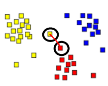
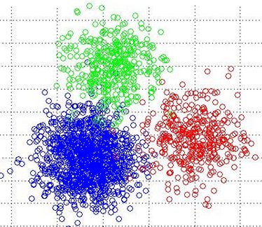

```{r setup, include=FALSE}
knitr::opts_chunk$set(echo = TRUE)
```


# Clustering 

Here we will consider a couple of approaches known as 1) Hierarchical and 2) K-Means Clustering. We'll consider Hierachical Clustering first. This takes data and puts each data point / observation into it's own cluster. The individual points/clusters are merged into pairs of clusters until there is a single cluster. This is what Hierachical Clustering does. To be specific the recursive algorithm is:

* Find the two closest points in the dataset
* Link these points and consider them as a single point
* The process starts again, now using the the new dataset that contains the new point.

## Distance 
To do this requires us to measure the distance between points. The aim is that the measured distances between observations of the same cluster are as small as possible and the distances between clusters are as large as possible. There are a number of methods to compute distances such as:

* Euclidean
* Maximum 
* Manhattan
* Canberra
* Binary
* Perason
* Correlation
* Spearman 

One of the simplest is to use the "euclidean distance". Here is how we might compute the distance between two vectors. 

```{r}
v1 <- c(0,1,1,0,0,1,1,0,1)

v2 <- c(0,1,1,0,0,1,1,0,1)

v3 <- c(0,1,1,0,0,1,1,0,0)

 sqrt(sum((v1-rev(v2))^2))

# These are identical so there should not be any distance

dist(rbind(v1,v2))

dist(rbind(v1,v3))

dist(rbind(v1,rev(v2)))

dist(rbind(rbind(v1,v2,v3)))
```

Note that if the vectors are not on the same scale then we need to standardize the data - subtract each vector element from it's mean and then divide by the standard deviation. Anyway R has a function called **dist** that supports many distance methods:

```{r eval=FALSE}
dist(x, method = "euclidean", diag = FALSE, upper = FALSE, p = 2)

the distance measure to be used. This must be one of "euclidean", "maximum", 
"manhattan", "canberra", "binary" or "minkowski". Any unambiguous substring can be given.
```

## Linkage

Tightly coupled with the idea of computing distance is the **linkage method** which is necessary for calculating the inter-cluster distances. 


| LINKAGE METHOD  | DEFINITION                                               |
|:----------------|:---------------------------------------------------------|
| Single Linkage  | The distance between two clusters is the minimum distance between an observation in one cluster and an observation in the other cluster. A good choice when clusters are obviously separated |
|                 |                                                          |
| Complete Linkage | The distance between two clusters is the maximum distance between an observation in one cluster and an observation in the other cluster. It can be sensitive to outliers |
|                 |   |
|Average Linkage | The distance between two clusters is the mean distance between an observation in one cluster and an observation in the other cluster|
|               |   |
|Centroid Linkage | The distance between two clusters is the distance between the cluster centroids or means|
|               |   |
|Median Linkage | The distance between two clusters is the median distance between an observation in one cluster and an observation in the other cluster. It reduces the effect of outliers|
|               |   |
|Ward Linkage | The distance between two clusters is the sum of the squared deviations from points to centroids. Try to minimize the within-cluster sum of squares. It can be sensitive to outliers|

Here are some graphic examples of distances and linkages between some example clusters. First we have:

### Minimum Distance



### Maximum Distance


### Centroid


## Hierarchical Clustering

Here is a graphic representation of what happens during HC:


## Clustering the Iris Data

Let's look at the built-in iris data that has three Species. We can group the 150 rows into clusters using Hieratchical clustering. We'll create a distance matrix. To do this we'll need to exclude the text that describes the Species since it is a label.

```{r}
data(iris)

str(iris)

dist.iris <- dist(iris[,-5])   # Default method is euclidean

# Now we pass the distance matrix to the hclust function

iris_hclust <- hclust(dist.iris)

# Clustered objects have their own special plot function that results
# in a Dendrogram

plot(iris_hclust, label=iris$Species, cex=0.4)

# There is another special plot that given a number of proposed clusters
# will draw a corresponding number of rectangles

rect.hclust(iris_hclust, k=3, border="red")
```

So one way to pick the number of clusters is by "drawing" a horizontal line across the vertical lines of the "dendrogram". The longer the vertical lines then the greater the difference between the clusters. The idea is to draw a vertical line in such a way as to cross over a number of vertical lines with some "wiggle room". We can do this visually or we could use the **cutree** function to do this.

```{r}
library(ggplot2)

iris_3 <- cutree(iris_hclust, k=3)

# iris_3 <-  cutree(iris_hclust, h=3.5)

labs <- factor(iris_3,labels=1:3)

ggplot(iris,aes(x=Sepal.Length,y=Sepal.Width,fill=labs)) +
       geom_point(pch=23,size=3.0) +
       ggtitle("3 Clusters, Dist: Euclidean, Method: Complete ")
```


Note that Hierarchical Clustering is not a classification method but since we created 3 clusters let's see how close the clusters match the actual Species given in the iris data frame. It seems like it got all of the Setosas correct, but it got only 23 of the Versicolors correct, and only one of the Virginicas correct.  But again, this isn't a classification method. 

```{r}
table(cluster=iris_3,species=iris$Species)

```

We could try a different number of clusters based on the dendrogram. 

```{r}

plot(iris_hclust, label=iris$Species, cex=0.4)

rect.hclust(iris_hclust, k=4, border="red")

iris_4 <- cutree(iris_hclust, k=4)

labs <- factor(iris_4,labels=1:4)

ggplot(iris,aes(x=Sepal.Length,y=Sepal.Width,fill=labs)) +
       geom_point(pch=23,size=3.0) +
       ggtitle("4 Clusters, Dist: Euclidean, Method: Complete ")

table(cluster=iris_4,species=iris$Species)

```

## Different Linkage Method

Let's pick a different linkage method. We'll select "Ward". Again, this isn't an attempt to do classification but in this case we see a better match between the actual Species and the predicted clusters.

```{r}

iris_hclust <- hclust(dist.iris, method="ward.D2")

plot(iris_hclust, label=iris$Species, cex=0.4)

rect.hclust(iris_hclust, k=3, border="red")

iris_3 <- cutree(iris_hclust, k=3)

labs <- factor(iris_3,labels=1:3)

ggplot(iris,aes(x=Sepal.Length,y=Sepal.Width,fill=labs)) +
       geom_point(pch=23,size=3.0) +
       ggtitle("3 Clusters, Dist: Euclidean, Method: Ward.D2")

table(cluster=iris_3,species=iris$Species)

```

## Looking at the mtcars data

We could look at the mtcars data frame and attempt to cluster those cars therein. We have a difference here in that the columns are not all measured on the same scale so we'll need to scale the data. 

```{r}
data(mtcars)

scaled.mtcars <- scale(mtcars)

dist.mtcars <- dist(scaled.mtcars)

mtcars_clust <- hclust(dist.mtcars,method="ward.D2")

plot(mtcars_clust,cex=0.8)

# Based on the plot let's try 4 clusters

rect.hclust(mtcars_clust, k=4, border="red")

mtcars_4 <- cutree(mtcars_clust, k=4)

labs <- factor(mtcars_4,labels=1:4)

ggplot(mtcars,aes(x=wt,y=mpg,fill=labs)) +
       geom_point(pch=23,size=3.0) +
       ggtitle("4 Clusters, Dist: Euclidean, Method: ward.D2")

table(cluster=mtcars_4,species=mtcars$cyl)
```

## K-Means Clustering

Before looking at a more interesting example let's consider a companion method to Hierarchical Clustering called K-Means cluster. K-Means is different in that we pick the number of clusters in advance. There are some helper functions that can assist us in determining the number of clusters but the idea here is if we have some intuition up front we pick he number of clusters. See http://www.di.fc.ul.pt/~jpn/r/clustering/clustering.html#k-means


1) Pick an initial set of K centroids (this can be random or any other means)

2) For each data point, assign it to the member of the closest centroid according to the given distance function

3) Adjust the centroid position as the mean of all its assigned member data points. 

4) Go back to (2) until the membership isn’t change and centroid position is stable.

5) Output the centroids.

Visually the result might look like:



```{r}

set.seed(101) # So you will get the same result as me

data(mtcars)

scaled.mtcars <- scale(mtcars)
set.seed(123)

km <- kmeans(scaled.mtcars,4)
labs <- factor(km$cluster,labels=1:4)
sm <- data.frame(scaled.mtcars)
centers <- as.data.frame(km$centers)

title <- "K-Means cluster with Centroids"
plot(sm$wt,sm$mpg,col=km$cluster,main=title)
points(km$centers[,c(6,1)],col=1:4,pch=19,cex=2)

grid()

table(cluster=km$cluster,cyl=mtcars$cyl)

lapply(split(iris,iris$Species),function(x) summary(x))

```

There are methods to selecting the so called optimal number of clusters such as noting at what point adding another cluster doesn't contribute to an explanation of the total variance in the data set. This is called the "elbow method". There are packages that can help you with this selection process such as the NbClust package in R. 

```{r}
library(NbClust)

scaled.mtcars <- scale(mtcars)

res <- NbClust(scaled.mtcars,distance="euclidean",
               min.nc=2,max.nc=6,method="ward.D2",
               index="silhouette")


res <- NbClust(scale(iris[,-5]),distance="euclidean",
               min.nc=2,max.nc=6,method="ward.D2",
               index="all")


```

# Let's go to the Movies

## Collaborative Filtering


         Men in Black    Apollo 13   Top Gun    Terminator
------  ------------  ----------- ----------  ----------
Amy           5             4          5            4
Bob           3                        2            5
Carl                        5          4            4
Dan           4             2          

* Given this data maybe we suggest to Carl that he watch "Men in Black" since Amy liked it and they appear to have similar preferences. This is known as **Collaborative Filtering**

* Can suggest things without understanding the underlying attributes of the movie

* There can be lots of information on each user times the total number of users ! Big Data

## Content Filtering

Consider the following line of thinking. Amy liked "Men in Black". We don't necessarily know why unless she tells us or makes some comments in a forum that we monitor. But based on the information that we have we can make some recommendations using the following considerations. The movie "Men in Black":

* Was directed by Barry Sonnenfeld so maybe recommend "Get Shorty" (directed by Sonnenfeld)

* Is classified in Action, Adventure, Sci-Fi, Comedy so maybe recommend "Jurassic Park" which is similarly classfied

* Stars Will Smith so maybe recommend another Will Smith comedy move like "Hutch"

* Also stars Tommy Lee Jones so maybe recommend "Space Cowboys" 

Content filtering requires little data to get started. Content-based filtering methods are based on a description of the item and maybe a profile of the user’s preference

## Hybrid Recommenders

Hybrid recommendation systems are also a possibility and offer a strong solutions:

* A collaborative filtering approach that finds that Amy and Carl have similar preferences

* After that we could then do content filtering where we find that "Terminator", which both Amy and Carl liked is also classified in the same set of genres as is "Starship Troopers"

* So recommend "Starship Troopers" even though neither have seen it

## Movie Lens

Movies in the dataset are categorized according to 18 different genres. Each movie can belong to different genres. Can we systematically find groups of movies with similar sets of genres ? 

Unsupervised learning goal is to segment the data into similar groups instead of doing predictions as to what group it belongs in. But once we observe the clusters we could then come up with some hypothesis about important variables that could be used in a classification problem.

So we put each data point into a group with "similar" values. It doesn't predict anything. This works best for large data sets. many different algorithms. we'll do hierarchical and k-means

## Hierarchical Clustering

Each data point starts in its own cluster. Then HC combines the two nearest into one clust

## R Markdown

```{r}
suppressMessages(library(dplyr))
url <- "http://files.grouplens.org/datasets/movielens/ml-100k/u.item"

movies <- read.table(url,header=FALSE,sep="|",quote="\"",stringsAsFactors = FALSE)

nrow(movies)

mnames <- c("ID","Title","ReleaseDate","VideoReleaseDate",
             "IMDB","Unknown","Action","Adventure","Animation",
             "Childrens","Comedy","Crime","Documentary",
             "Drama","Fantasy","FilmNoir","Horror","Musical",
              "Mystery","Romance","SciFi","Thriller",
              "War","Western")
  
  
colnames(movies) <- mnames

movies <- select(movies,-ID,-ReleaseDate,-VideoReleaseDate,-IMDB) %>% unique 

```

Okay how to analyze this stuff ? Let's cluster the movies by genre. Let's see how we can make recs. First we compute all distances then cluster

```{r}
distances <- dist(movies[,2:20],method="euclidean")
clusterMovies <- hclust(distances, method="ward.D")
plot(clusterMovies)

```

We can label each point by the cluster it belongs to 

```{r}
clusterGroups <- cutree(clusterMovies, k=10)

# Okay let's see how many Action Movies show up in each cluster - we want to compute a percentage

myt <- table(movies=movies$Action,clusters=clusterGroups)

# Okay divide the number of actual action movies (row 2) by the column sum to get the
# percentages. We now know the percentage of Action movies in each cluster. 

myt[2,]/colSums(myt)

# We should do this for each genre. Another way to do all this is this way

tapply(movies$Action,clusterGroups,mean)

# note the next line is pretty advanced - it's just a quick way to avoid for loops

myclusters <- data.frame(t(sapply(3:20,function(x) tapply(movies[,x],clusterGroups,mean))))

myclusters <- data.frame(sapply(myclusters,round,2))
rownames(myclusters) <- names(movies)[3:20]
colnames(myclusters) <- paste("C",1:10,sep="")

```

## Inspect the clusters for meaningful content

* Cluster 1 has lots of different movie types so it's like a Misc category. 
* Cluster 2 has lots of Action, Adventure, and Sci-fi
* Cluster 3 has lots of Crime, Mystery, and Thriller.
* Cluster 4 has ONLY Drama movies
* Cluster 5 has ONLY Comedy movies
* Cluster 6 has mostly Romance movies
* Cluster 7 has lots of Comedy and Romance movies 
* Cluster 8 has Documentary 
* Cluster 9 has Comedy and Drama
* Cluster 10 has mostly Horror

So what if we like the movie Men in Black. What other movies might we want to see based on our clustering scheme ? 


```{r}
movies[movies$Title=="Men in Black (1997)",]

# So row 257 corresponds to MIB. Which cluster did 257 go into

clusterGroups[257]

cluster2 <- movies[clusterGroups == 2,]
cluster2$Title[1:20]

# We could use NbClust to tell us how many clusters we might consider. This takes about 5 mins

# res <- NbClust(movies[,2:20],distance="euclidean",
#               min.nc=2,max.nc=6,method="ward.D2",
#               index="all")

# Practice using the following information


url <- "http://archive.ics.uci.edu/ml/machine-learning-databases/pima-indians-diabetes/pima-indians-diabetes.data"
diab <- read.csv(url,header=F)
head(diab)
  
names(diab) <- c("numpreg","glucose","dbp","tsk","thrserum","bmi","dpf","age","class")
